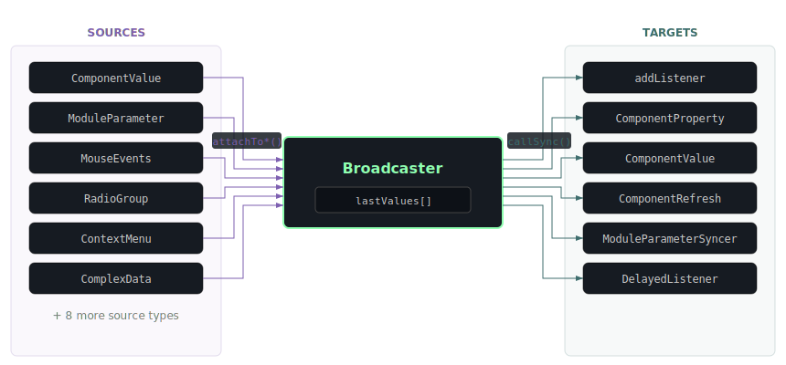
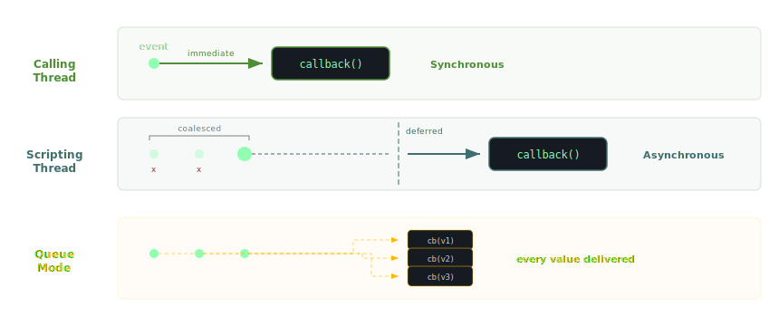

<!-- Diagram triage:
  - source-target-flow: RENDER (core architectural diagram -- the hub topology is the defining concept of Broadcaster)
  - threading-dispatch: RENDER (sync vs async + queue mode is the key operational concept)
  - attachToComplexData topology: CUT (simple linear flow, covered by prose)
  - attachToModuleParameter topology: CUT (similar linear flow, covered by prose and value description table)
-->
# Broadcaster

The [Observer Pattern](https://en.wikipedia.org/wiki/Observer_pattern) is used throughout JUCE and HISE to decouple event producers from consumers. In HiseScript you could implement it manually with an array of registered functions, a `sendMessage` function that iterates them, and change detection -- but this requires boilerplate for every observer, provides no async support, no debugging tools, and makes it easy to mess up function argument counts. The Broadcaster object gives you the same functionality with a clean interface, async callback support, and full visual debugging via the BroadcasterMap panel.

A reactive event hub that connects event sources to event targets through structured messages with named arguments. The following diagram shows the basic architecture:



- **Sources** (left) detect external changes and push messages into the broadcaster. Attach sources with the `attachTo*` family of methods to monitor component values, component properties, module parameters, mouse events, context menus, EQ events, sample maps, routing matrices, complex data, radio groups, interface size, processing specs, non-realtime state changes, or other broadcasters.
- **Targets** (right) receive messages when the broadcaster fires. Register targets with `addListener`, `addDelayedListener`, `addComponentPropertyListener`, `addComponentValueListener`, `addComponentRefreshListener`, or `addModuleParameterSyncer`.
- The **hub** stores the last received values in `lastValues[]` and uses change detection to suppress duplicate messages by default.

Each broadcaster is created with a fixed set of named arguments that become dot-accessible properties for reading and writing values:

```js
const var bc = Engine.createBroadcaster({
    id: "myBroadcaster",
    args: ["component", "value"]
});

// Dot-assignment triggers a synchronous send
bc.value = 42;

// Read the last value
var v = bc.value;
```

Each `attachTo*` method requires a specific argument count on the broadcaster (e.g. `attachToComponentValue` needs 2, `attachToModuleParameter` needs 3). A mismatch produces a descriptive error at compile time. Broadcasters can also be called as functions - `bc(arg1, arg2)` sends synchronously when no sources are attached, or asynchronously when sources are attached.

## Metadata

Both sources and targets carry metadata (a string ID or JSON object) used for identification, execution order, and visual debugging in the BroadcasterMap panel.

| Metadata Property | Type | Purpose |
|---|---|---|
| `id` | String | Identifier for removal and debug display |
| `priority` | int | Execution order (higher values execute first, default `0`) |
| `colour` | int | Colour for BroadcasterMap visualisation |
| `comment` | String | Description shown in BroadcasterMap |
| `tags` | Array | Filtering tags for BroadcasterMap |

When a broadcaster fires, its targets execute sequentially in **priority order** (higher values first). Targets with the same priority execute in registration order. This matters in complex setups where one listener's side effects must complete before the next listener reads the updated state - for example, a data-transform listener that normalises a value before a UI listener displays it:

```js
bc.addListener("", { id: "updateUI", priority: 10 }, function(component, value) {
    // Runs first: update the UI state
});

bc.addListener("", { id: "logChange", priority: 0 }, function(component, value) {
    // Runs second: log after UI is updated
});
```

## Dispatch Modes

Messages can be dispatched in three modes, shown in the following diagram:



1. **Asynchronous** (default) -- Messages are posted to the scripting thread and delivered on the next timer tick. Rapid value changes between ticks are coalesced: only the latest value reaches the callback, intermediate values are silently discarded.
2. **Synchronous** -- The callback fires immediately on the calling thread. Enable with `setForceSynchronousExecution`. If the calling thread is the audio thread, the callback must be an `inline function`.
3. **Queue mode** -- Every value is delivered as a separate callback, even when values arrive faster than the dispatch rate. Enable with `setEnableQueue`. Some `attachTo*` methods enable this automatically.

For audio-thread-safe operation without locks, enable realtime mode with `setRealtimeMode`. To temporarily suppress all listener dispatch without losing incoming values, use `setBypassed`.

## Compatibility with Callback Slots

Many HiseScript APIs accept a function reference for a callback slot - for example `ErrorHandler.setErrorCallback()`, `MIDIPlayer.setPlaybackCallback()`, or `ScriptPanel.setFileDropCallback()`. Instead of passing a function, you can pass a Broadcaster object directly. It will call its registered listeners (asynchronously) every time the callback fires. The broadcaster's argument count must match the expected callback parameter count.

## Common Mistakes

- **Match argument count to source type**
  **Wrong:** Creating a broadcaster with the wrong argument count for the intended `attachTo*` method.
  **Right:** Match the argument count to the source type: 1 for radio groups and non-realtime changes, 2 for component values, mouse events, interface size, processing specs, routing matrices, EQ events, and context menus, 3 for component properties, module parameters, complex data, and sample maps.
  *Each attach method validates the argument count and throws a descriptive error, but mismatches are a common setup stumble.*

- **New object instance or enable queue**
  **Wrong:** Mutating an object in-place and resending it, expecting change detection to trigger.
  **Right:** Create a new object instance, or enable queue mode with `setEnableQueue(true)`.
  *Change detection compares by reference for objects. Modifying properties on the same object reference does not count as a change.*

- **Callback receives extra targetIndex parameter**
  **Wrong:** Providing a callback to `addComponentPropertyListener` or `addComponentValueListener` with the wrong parameter count.
  **Right:** The callback receives `targetIndex` as an extra first parameter (N+1 total) and must return the value to set.
  *Forgetting the extra `targetIndex` shifts all arguments. Forgetting the return value triggers an error.*

- **Cache component references at init time**
  **Wrong:** Using `Content.getComponent()` inside a broadcaster callback to look up components on every fire.
  **Right:** Cache component references in `const var` at init time and pass them via closure or the `object` parameter.
  *Broadcaster callbacks can fire frequently. Repeated lookups are unnecessary overhead when references can be cached once.*

- **Use central broadcaster for decoupling**
  **Wrong:** Adding listeners in many separate scripts that directly call each other's functions.
  **Right:** Define core broadcasters in a central data file and subscribe from feature modules.
  *Broadcasters decouple event producers from consumers. A single broadcaster can notify 10+ scripts without any script knowing about the others.*
