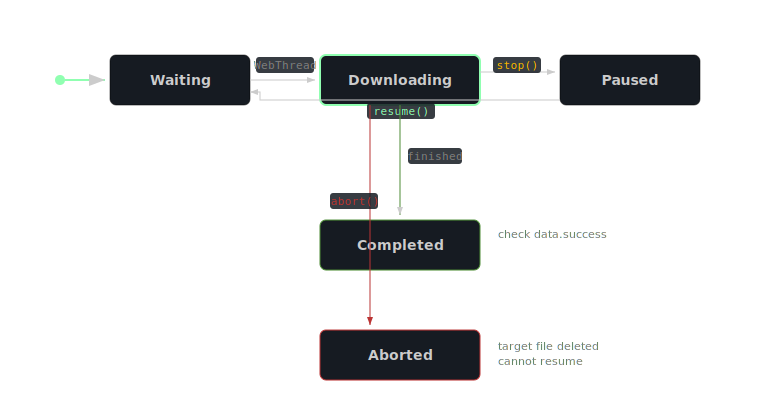

<!-- Diagram triage:
  - download-lifecycle: RENDER (state machine with branching transitions and resume loop - not expressible in prose alone)
-->

# Download

Download represents an active HTTP file download, providing progress monitoring and lifecycle control (pause, resume, abort). Download objects are not created directly - they are returned by `Server.downloadFile()` and passed as the `this` context to the callback function you supply.

The callback takes zero arguments. Access download state through `this.data` and call methods like `this.getProgress()` or `this.getStatusText()` from within the callback. The callback fires at key lifecycle points: on initial start, periodically during transfer (roughly every 100ms), and on stop, abort, or completion.

Downloads progress through five states:

| Status | Description |
|--------|-------------|
| `"Waiting"` | Queued but not yet started |
| `"Downloading"` | Actively transferring data |
| `"Paused"` | Stopped via `stop()`; can be resumed |
| `"Completed"` | Transfer finished (check `data.success` to distinguish success from failure) |
| `"Aborted"` | Cancelled via `abort()`; target file deleted |

The `data` property object carries mutable state updated during the transfer:

| Property | Type | Description |
|----------|------|-------------|
| `numTotal` | int | Total download size in bytes |
| `numDownloaded` | int | Bytes downloaded so far |
| `finished` | bool | Whether the download has completed |
| `success` | bool | Whether the download completed successfully |
| `aborted` | bool | Whether the download was aborted |

A stopped download can be resumed with `resume()`, which uses HTTP Range headers to continue from where it left off. An aborted download cannot be resumed - the target file is deleted and a new download must be started. If `Server.downloadFile()` is called with a URL that matches an already-pending download, the existing Download object is returned with its callback replaced.

> The Server enforces a maximum number of concurrent downloads (default: 1, configurable via `Server.setNumAllowedDownloads()`). Excess downloads remain in `"Waiting"` state until a slot becomes available. All lifecycle methods (`stop()`, `resume()`, `abort()`) are asynchronous - they set flags that the background thread acts upon, so state changes may not be immediate.

> During development, use the ServerController floating tile to inspect active downloads and their state in real time.

## Common Mistakes

- **$COMMON_MISTAKE_TITLE_TO_BE_REPLACED$**
  **Wrong:** `Server.downloadFile(url, {}, f, function(dl){ dl.getProgress(); });`
  **Right:** `Server.downloadFile(url, {}, f, function(){ this.getProgress(); });`
  *The callback takes zero arguments. The Download object is bound as `this`, not passed as a parameter.*

- **$COMMON_MISTAKE_TITLE_TO_BE_REPLACED$**
  **Wrong:** Calling `resume()` after `abort()`
  **Right:** Call `Server.downloadFile()` to start a fresh download
  *`abort()` deletes the target file and marks the download as finished. It cannot be resumed.*
