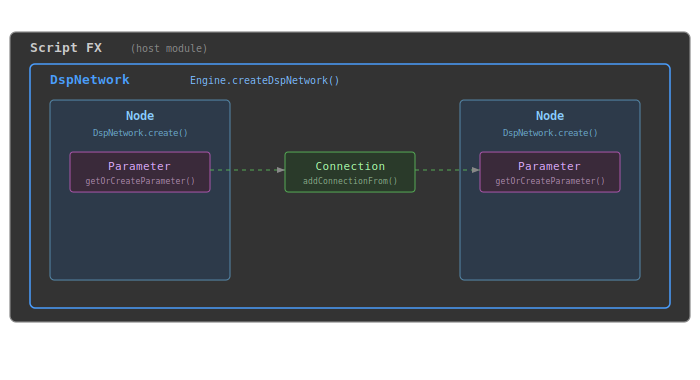

# DspNetwork

`DspNetwork` is the top-level container for a scriptnode DSP graph and the entry point for all scriptnode scripting operations. It manages a tree of processing nodes that define an audio signal chain.



The following modules can host a DspNetwork:

| Processor ID | UI Name | Module Type |
|---|---|---|
| `ScriptFX` | Script FX | Master Effect |
| `PolyScriptFX` | Polyphonic Script FX | Voice Effect |
| `ScriptSynth` | Scriptnode Synthesiser | Sound Generator |
| `ScriptTimeVariantModulator` | Script Time Variant Modulator | Time Variant Modulator |
| `ScriptEnvelopeModulator` | Script Envelope Modulator | Envelope Modulator |

These modules are dual-purpose: they run plain HiseScript by default and become scriptnode hosts when `Engine.createDspNetwork()` is called inside them. Plain Script Processors and Script Voice Start Modulators cannot host a DspNetwork.

A DspNetwork provides:

1. **Visual graph authoring** - build signal chains in the scriptnode editor with immediate visual feedback, saved as XML
2. **Node lifecycle management** - create, look up, and remove nodes identified by factory path and unique ID
3. **Parameter forwarding** - expose root node parameters to DAW automation
4. **C++ compilation pipeline** - convert authored graphs to compiled C++ for production performance without changing the authoring workflow
5. **Undo support** - transaction-based undo for graph editing operations in the HISE IDE

## How to Obtain

There are several ways to create or access a DspNetwork:

| Method | Returns | When to Use |
|--------|---------|-------------|
| UI workflow (package icon / XML file selection) | - | Default approach. Sufficient for most use cases where you do not need to interact with the network from script. |
| []($API$Engine#createDspNetwork) | `DspNetwork` | When you need a script reference to the network on the same processor - e.g. programmatic node creation, parameter queries, or `setForwardControlsToParameters()`. |
| `Engine.getDspNetworkReference("processorId", "id")` | `DspNetwork` | When accessing a scriptnode network from the main interface script, avoiding complex cross-module script communication. |
| `SlotFX.setEffect("networkName")` | `Effect` | When dynamically swapping between multiple scriptnode networks at runtime via the Effect API. Does not return a DspNetwork directly. |

For most workflows, the visual approach is sufficient: create a DspNetwork in the HISE IDE using the package icon in a script processor module, build the graph in the scriptnode editor, and leave the script callbacks empty. The hosting processor handles audio routing automatically.

When you do need a script reference:

```javascript
// On the same processor
const var nw = Engine.createDspNetwork("MyNetwork");

// From the main interface script (cross-processor access)
const var nw = Engine.getDspNetworkReference("ScriptFX1", "MyNetwork");
```

For advanced use cases, nodes can be created programmatically using `create()`, `createAndAdd()`, or `createFromJSON()`. Nodes are identified by a factory path in `factory.node` format (e.g. `core.gain`, `container.split`) and a unique string ID. Bracket syntax provides shorthand node access:

```javascript
const var ref = nw["myGain"];
```

The graph architecture consists of a hierarchical tree rooted at a `container.chain` node. Node factories (container, core, math, fx, and others) create nodes by matching the factory path prefix. Root node parameters are automatically bridged to the host DAW when parameter forwarding is enabled.

> [!Warning:Host modules only] Only the five module types listed above can host a DspNetwork. Using `Engine.createDspNetwork()` in a plain Script Processor or Script Voice Start Modulator reports an error.

> [!Tip:No bracket assignment] Assignment via bracket syntax (`nw["id"] = value`) is not supported and reports a script error. Use node parameter methods instead.

## Common Mistakes

- **Wrong:** Writing custom `processBlock` logic to feed audio into a hosted network
  **Right:** Leave `processBlock` empty and let the hosting processor handle audio routing
  *The hosting processor automatically connects the network to the audio stream. Manual `processBlock` is only needed for standalone buffer processing outside a hosted context.*

- **Wrong:** Creating nodes programmatically when the graph is static
  **Right:** Use the visual scriptnode editor and save as XML
  *Programmatic creation adds complexity without benefit for fixed signal chains. The visual editor provides immediate feedback and the XML format supports compilation to C++.*
