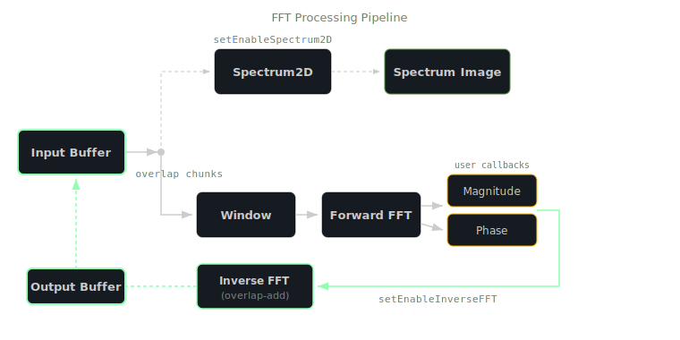

<!-- Diagram triage:
  - fft-processing-pipeline: RENDER (dual-path topology with parallel Spectrum2D and callback paths, overlap-add reconstruction - not expressible in prose alone)
-->

# FFT

FFT is a windowed Fast Fourier Transform processor that operates on Buffer objects. It provides spectral analysis with per-chunk magnitude and phase callbacks, optional inverse FFT for spectral resynthesis, and 2D spectrogram image generation.

Create an FFT instance with:

```javascript
const var fft = Engine.createFFT();
```

The processing pipeline has two independent paths that can run simultaneously:



1. **Callback path** - processes the input buffer in overlapping chunks. Each chunk is windowed, forward-transformed, and passed to user-defined magnitude and/or phase callbacks. When inverse FFT is enabled, modified spectral data is reconstructed into a time-domain output buffer using overlap-add.
2. **Spectrum2D path** - generates a spectrogram image from the input buffer, which can be drawn with `Graphics.drawFFTSpectrum()`.

A typical setup configures the window type, overlap, and callbacks before calling `prepare()` with a power-of-two FFT size:

```javascript
fft.setWindowType(fft.Hann);
fft.setOverlap(0.5);
fft.setMagnitudeFunction(function(magnitudes, offset)
{
    // magnitudes: Buffer with frequency bin amplitudes
    // offset: current position in the source buffer
}, false);

fft.prepare(1024, 1);
```

Window type constants control the spectral windowing applied to each chunk before the forward transform:

| Constant | Value | Description |
|----------|-------|-------------|
| `fft.Rectangle` | 0 | No windowing (rectangular) |
| `fft.Triangle` | 1 | Triangular window |
| `fft.Hamming` | 2 | Hamming window |
| `fft.Hann` | 3 | Hann window |
| `fft.BlackmanHarris` | 4 | Blackman-Harris window |
| `fft.Kaiser` | 5 | Kaiser window |
| `fft.FlatTop` | 6 | Flat-top window |

> Multi-channel processing supports up to 16 channels. Pass an Array of Buffers to `process()` for multi-channel input; callbacks receive an Array of Buffers instead of a single Buffer.

## Common Mistakes

- **Wrong:** `fft.process(buf)` without calling `prepare()` first
  **Right:** `fft.prepare(1024, 1); fft.process(buf);`
  *`process()` throws "You must call prepare before process" if internal buffers have not been allocated.*

- **Wrong:** `fft.prepare(500, 1)` with a non-power-of-two size
  **Right:** `fft.prepare(512, 1)` using a power of two (256, 512, 1024, 2048, etc.)
  *The FFT size must be a power of two. Non-power-of-two values throw an error at prepare time.*

- **Wrong:** Calling `dumpSpectrum()` without the fallback engine
  **Right:** Call `fft.setUseFallbackEngine(true)` before `fft.prepare()`
  *`dumpSpectrum()` requires the JUCE fallback FFT engine. Without it, you get "You must use the fallback engine if you want to dump FFT images".*
