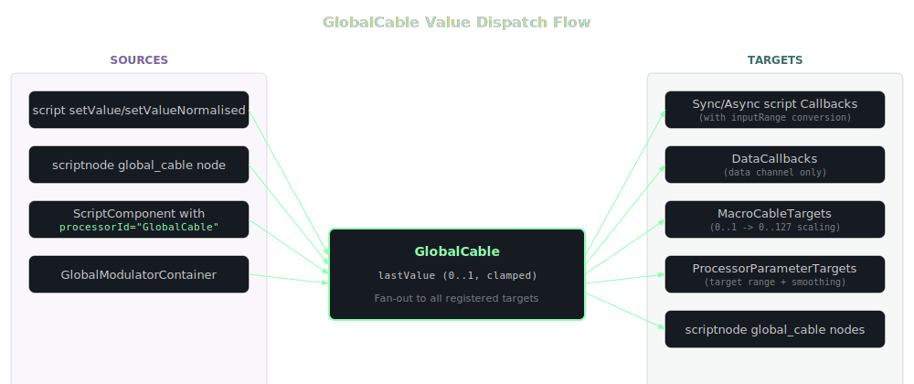
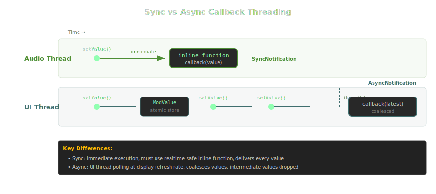

<!-- Diagram triage:
  - cable-dispatch: RENDER (complex fan-in/fan-out topology not expressible in prose)
  - callback-threading: RENDER (coalescing and thread-crossing behavior benefits from visual)
  - registerCallback method-level: CUT (redundant with class-level callback-threading)
-->
# GlobalCable

GlobalCable is a named data bus obtained via `Engine.getGlobalRoutingManager().getCable("cableId")`. It lets you route values and arbitrary data between script processors, scriptnode nodes, UI components, macro controls, and module parameters -- all by sharing a cable name. Each cable carries two independent channels: a **value channel** (normalised 0..1 doubles) and a **data channel** (JSON, strings, arrays, or buffers sent via `sendData()`).

Each script reference to a cable has its own local input range, set with `setRange()`, `setRangeWithSkew()`, or `setRangeWithStep()`. The range-aware methods -- `setValue()`, `getValue()`, and value callbacks -- convert between your user-facing range and the internal 0..1 space automatically. The "Normalised" variants (`setValueNormalised()`, `getValueNormalised()`) bypass the range and work directly in 0..1.

Value callbacks registered with `registerCallback()` can run synchronously on the calling thread (requires an `inline function`) or asynchronously on the UI thread. Async callbacks coalesce rapid changes and deliver only the most recent value. Data callbacks registered with `registerDataCallback()` are always asynchronous.

Beyond script callbacks, cables can also drive macro controls via `connectToMacroControl()`, module parameters via `connectToModuleParameter()`, and receive values from global modulators via `connectToGlobalModulator()`.
