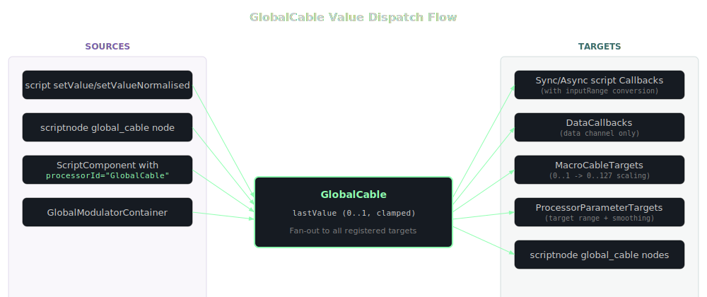

# GlobalCable

GlobalCable is a named, project-wide data bus for routing values and structured data between different parts of a HISE project:

- Script processors
- DSP networks
- UI components
- Macros and module parameters

You obtain a cable reference from the global routing manager:

```js
const var rm = Engine.getGlobalRoutingManager();
const var cable = rm.getCable("cableId");
```

Each cable has two independent channels: a value channel that carries a normalised 0..1 double, and a data channel for JSON objects, strings, or buffers.

Each cable reference maintains a local input range that maps user-facing values to and from the internal 0..1 transport. For example, a cable with `setRange(20.0, 20000.0)` converts `setValue(440.0)` to roughly 0.02 before sending, and converts it back to 440.0 when reading with `getValue()`.

Cables can deliver values through callbacks (synchronous or asynchronous) or be wired directly into the HISE module tree for parameter routing without a script middleman.



> Cable IDs with a `/` prefix (e.g. `/some_osc_id`) automatically become OSC addresses when the global routing system runs as an OSC server.

## Common Mistakes

- **Wrong:** Using a non-realtime-safe function as a synchronous callback
  **Right:** Use `inline function` or pass `AsyncNotification`
  *Synchronous callbacks run on the calling thread which may be the audio thread. Non-realtime-safe functions are silently rejected - the callback never fires.*

- **Wrong:** Calling `sendData()` from the audio thread
  **Right:** Move data sending to a timer or async context
  *`sendData()` performs a heap allocation internally, which is not audio-thread safe.*

- **Wrong:** Polling `getValue()` in `onTimer` at 30ms for visual feedback without smoothing
  **Right:** Apply exponential smoothing (`smoothed = smoothed * 0.6 + newValue * 0.4`) before rendering
  *Raw cable values from DSP networks can change abruptly between timer ticks. Smoothing produces visually stable animations without requiring faster polling.*

- **Wrong:** Creating many cables with separate `getGlobalRoutingManager()` calls
  **Right:** Call `Engine.getGlobalRoutingManager()` once, store in `const var rm`, then call `rm.getCable()` for each cable
  *The routing manager is a singleton; repeated `getGlobalRoutingManager()` calls work but are wasteful. Cache the reference at init time.*

- **Wrong:** Using `registerCallback` with `SyncNotification` for UI updates
  **Right:** Use `AsyncNotification` or timer-polled `getValue()` for anything that triggers repaints
  *Synchronous callbacks run on the calling thread (possibly the audio thread). UI operations like `repaint()` or `Console.print()` are not realtime-safe and will silently fail or cause audio glitches.*
