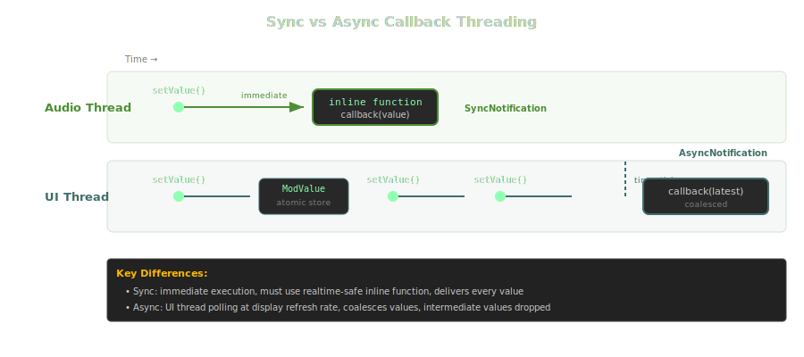

Registers a function to be called whenever a value is sent through the cable. The callback receives the cable value converted through the local input range. Multiple callbacks can be registered per cable reference.

With `SyncNotification`, the callback executes immediately on the calling thread (which may be the audio thread) and the function must be an `inline function`. If not realtime-safe, the registration silently fails and the callback never fires.

With `AsyncNotification`, the callback executes asynchronously on the UI thread via timer polling. Rapid value changes are coalesced - only the most recent value is delivered, intermediate values are dropped.

> **Warning:** Synchronous callbacks with non-realtime-safe functions are silently ignored - the callback never fires, with no error message.