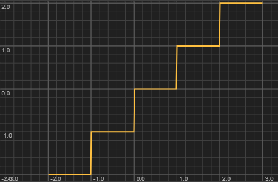

Rounds the value down to the nearest integer. Always returns a double. For negative values, this rounds away from zero: `Math.floor(-2.3)` returns -3.0. Use `Math.trunc()` to round toward zero instead.
