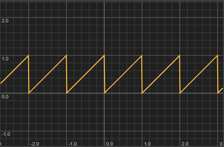

Returns the floating-point remainder of dividing the value by the limit. The result has the same sign as the dividend. Two common use cases:

- **Fractional part extraction:** `Math.fmod(value, 1.0)` returns the decimal portion of a number.
- **Range looping:** `value -= Math.fmod(value, stepSize)` snaps a continuous value to the nearest step below it (useful for zoom levels, grid quantisation, and discrete increments).

For cyclic wrapping where negative values should stay positive, use `Math.wrap()` instead.

> [!Warning:NaN on zero divisor] Returns NaN (not an error) when the limit is zero. If the divisor comes from user input or a calculation, guard against zero before calling.
