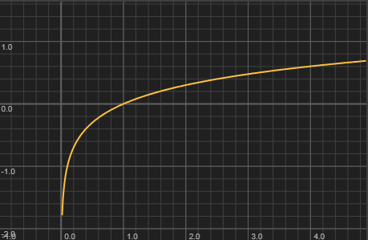

Returns the base-10 logarithm of the value. The input must be positive. Useful for determining decimal places from a step size: `parseInt(Math.log10(stepSize) * -1)` gives the number of digits after the decimal point.
