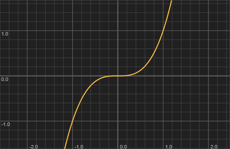

Returns the base raised to the power of the exponent. Common audio uses include perceptual scaling curves (`Math.pow(peak, 0.25)` for meter displays) and biased random distributions (`Math.pow(Math.random(), 1.5)` for timing humanisation). For symmetrical forward/inverse mappings, use reciprocal exponents: if the forward curve uses exponent 4.0, the inverse uses 0.25.

For simple squaring, `x * x` is faster than `Math.pow(x, 2.0)`, and `Math.sqr(x)` is available as a dedicated shortcut.
