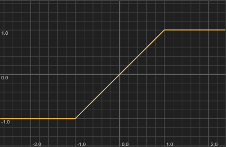

Limits the value to the range [lowerLimit, upperLimit]. This is the most commonly used Math function, appearing in virtually every ScriptPanel mouse callback and drag handler to constrain normalised coordinates to [0.0, 1.0]. `Math.clamp()` is an identical alias.

> [!Warning:Integer path ignores fractional limits] Type preservation is based on the value parameter, not the limits. `Math.range(5, 0.0, 10.5)` takes the integer path because 5 is an int, which silently truncates the fractional upper limit.
