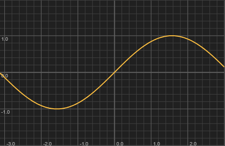

Returns the sine of the angle (in radians). Commonly used together with `Math.cos()` to compute positions along a circular arc for UI layouts such as LED rings, rotary indicators, or LFO waveform visualisation.
