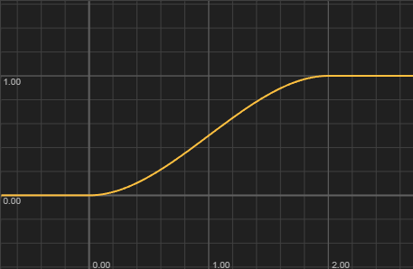

Returns a smooth S-curve transition between 0.0 and 1.0 using cubic Hermite interpolation (`t*t*(3-2*t)`). The output is 0.0 when the input is at or below the lower edge, 1.0 when at or above the upper edge, and a smooth curve in between.

This is useful for creating gradual transitions in DSP processing (crossfades, soft knee compression curves) and for smoothing MIDI controller input or UI animation values. The function is commonly used in shader programming (see The Book of Shaders) and the same principles apply in audio contexts.

> [!Warning:Silent fallback on invalid edges] Returns 0.0 (not an error) when the upper edge is less than or equal to the lower edge.
