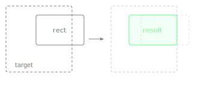

Returns a new Rectangle that is moved to fit inside the given target area, keeping its size unchanged when it already fits.

If this rectangle is larger than the target in either dimension, the result is clamped to the target's bounds on that axis. Useful for keeping tooltips, popups, or dragged elements from overflowing their parent bounds.