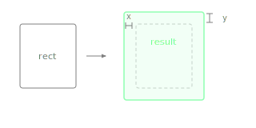

Returns a new Rectangle that is larger than this one by moving each edge outward.

With one argument, all four edges expand uniformly. With two arguments, the first controls horizontal expansion and the second controls vertical. The width and height each increase by twice the given amount (once per edge). This is the inverse of `reduced()`.