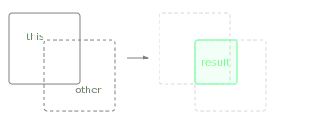

Returns a new Rectangle representing the overlapping area shared by this rectangle and another.

If the two rectangles do not overlap, the result is empty (check with `isEmpty()`). Useful for clipping a draw region to a visible area or determining the exact overlap between two UI elements.