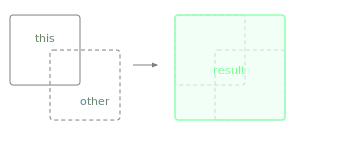

Returns the smallest Rectangle that contains both this rectangle and another.

This is the bounding box of the two rectangles combined - useful for calculating the total area needed to enclose multiple UI elements.