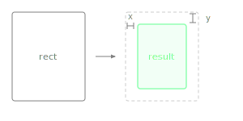

Returns a new Rectangle that is smaller than this one by moving each edge inward.

With one argument, all four edges are reduced uniformly. With two arguments, the first controls horizontal reduction and the second controls vertical. This is the inverse of `expanded()` and the standard way to add padding inside a layout area.

> **Warning:** `reduced(10)` shrinks each edge by 10, so the total width and height each decrease by 20. This matches the JUCE convention but often surprises developers who expect the total reduction to equal the argument. Use negative values to expand instead of shrink.