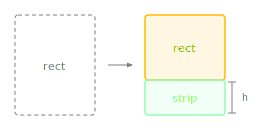

Slices a strip from the bottom of this rectangle.

The source rectangle shrinks (its height decreases) and the method returns the removed strip as a new Rectangle. This and its siblings `removeFromTop()`, `removeFromLeft()`, and `removeFromRight()` form the layout slicing pattern for progressively dividing a draw area into sub-regions.