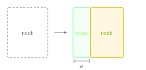

Slices a strip from the left side of this rectangle.

The source rectangle shrinks (its left edge moves rightward) and the method returns the removed strip as a new Rectangle. Commonly used to allocate space for icons, labels, or margins before processing the remaining area.

> [!Warning:Wrap LAF obj.area in Rectangle first] When slicing stored areas from LAF callbacks (like `obj.area`), always wrap in `Rectangle()` first. If `obj.area` is still a plain array, slicing it mutates the array in place, which corrupts the original for subsequent repaints.