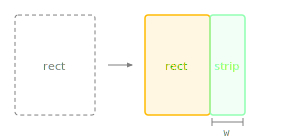

Slices a strip from the right side of this rectangle.

The source rectangle shrinks (its right edge moves leftward) and the method returns the removed strip as a new Rectangle. Commonly used to allocate space for trailing icons, action buttons, or dropdown arrows while the remaining area holds text content.