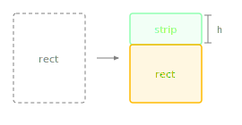

Slices a strip from the top of this rectangle.

The source rectangle shrinks (its top edge moves downward) and the method returns the removed strip as a new Rectangle. The most common starting point for layout slicing - typically used to carve out a header or title bar from a panel's draw area before processing the remaining content region.