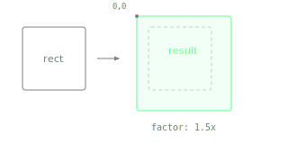

Returns a new Rectangle with both position and size multiplied by the given factor.

With one argument, both axes scale uniformly. With two arguments, the first scales horizontally and the second vertically.

> [!Warning:$WARNING_TO_BE_REPLACED$] Scaling transforms the position as well as the size. A rectangle not at the origin will move toward or away from `(0, 0)`. To scale only the size while keeping the centre fixed, use `withSizeKeepingCentre()` instead.