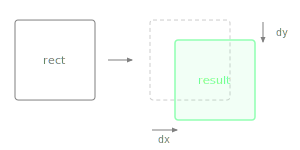

Returns a new Rectangle shifted by the given horizontal and vertical offsets, with size unchanged.

Positive values move right and down. Useful for converting component-local bounds to parent-relative coordinates, or for nudging a sliced region into its final position as part of a method chain.