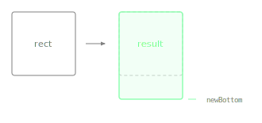

Returns a new Rectangle with its bottom edge moved to the given y coordinate while keeping the top edge fixed.

The height adjusts to span from the original top to the new bottom position. Compare with `withBottomY()`, which moves the entire rectangle vertically instead of resizing it.