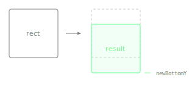

Returns a new Rectangle with the same size, repositioned vertically so its bottom edge is at the given y coordinate.

Unlike `withBottom()`, which changes the height while keeping the top edge fixed, this keeps the size unchanged and moves the entire rectangle.