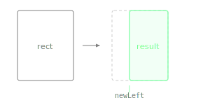

Returns a new Rectangle with its left edge at the given x coordinate while keeping the right edge fixed.

The width adjusts to span from the new left to the original right edge. Compare with `withX()`, which moves the entire rectangle horizontally instead of resizing it.