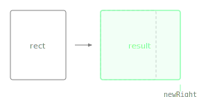

Returns a new Rectangle with its right edge at the given x coordinate while keeping the left edge fixed.

The width adjusts to span from the original left edge to the new right position. Compare with `withWidth()`, which changes the width while keeping the left edge fixed but without specifying an absolute right coordinate.