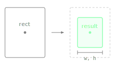

Returns a new Rectangle resized to the given width and height, centred at the same position as this one.

The rectangle expands or contracts symmetrically around its centre point. The original rectangle is not modified. This is the standard approach for centring a fixed-size element (icon, indicator, knob handle) inside a larger allocated area, and is more readable than manual centre-offset arithmetic.