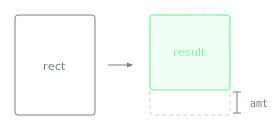

Returns a new Rectangle with the given amount removed from the bottom edge, without modifying the original.

Unlike `removeFromBottom()`, this does not mutate the source and does not return the removed strip - it returns the remaining area only.