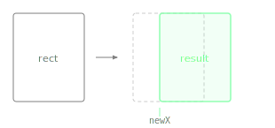

Returns a new Rectangle moved horizontally so its left edge is at the given x coordinate, keeping its size unchanged.

Unlike `withLeft()`, which keeps the right edge fixed and adjusts the width, this preserves the width and repositions the entire rectangle.