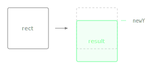

Returns a new Rectangle moved vertically so its top edge is at the given y coordinate, keeping its size unchanged.

Unlike `withBottomY()`, which positions by the bottom edge, this positions by the top edge.