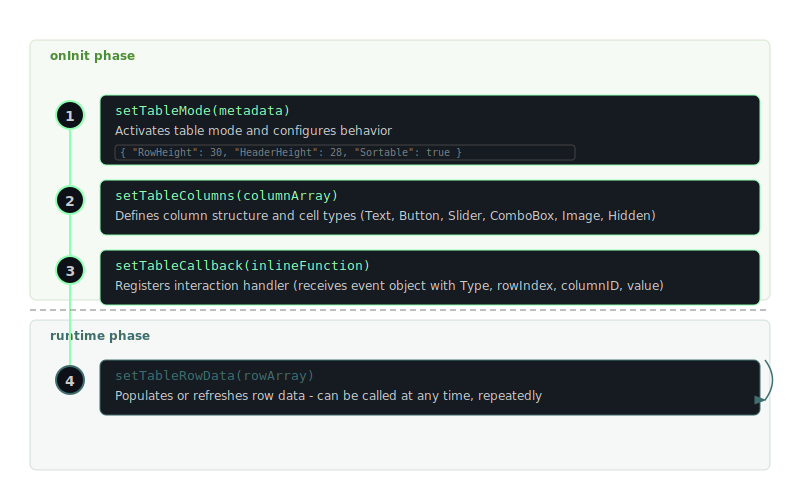

<!-- Diagram triage:
  - viewport-modes: CUT (3-row mode table already conveys this clearly)
  - table-setup: RENDER (sequence replaces setup ordering prose)
-->
# ScriptedViewport

ScriptedViewport is a UI component created with `Content.addViewport("id", x, y)`. It operates in one of three modes, chosen during `onInit`:

| Mode | How to activate | Value |
|------|----------------|-------|
| Viewport | Default (no flags) | Arbitrary (set via `setValue`) |
| List | Set `useList` property to `true` | Selected row index (0-based) |
| Table | Call `setTableMode()` in onInit | Row index, or `[column, row]` array in multi-column mode |

In **Viewport mode** the component acts as a scrollable container -- child components placed inside it can exceed the visible area and the user scrolls to reach them. In **List mode** it displays a selectable list of text items populated from the `items` property (newline-separated strings). **Table mode** requires a specific setup sequence:

The seven viewport-specific methods handle table/list setup and interaction. The remaining methods are common to all UI components. You can customize the visual appearance of rows, cells, headers, and scrollbars through a local look-and-feel object assigned with `setLocalLookAndFeel()`.
