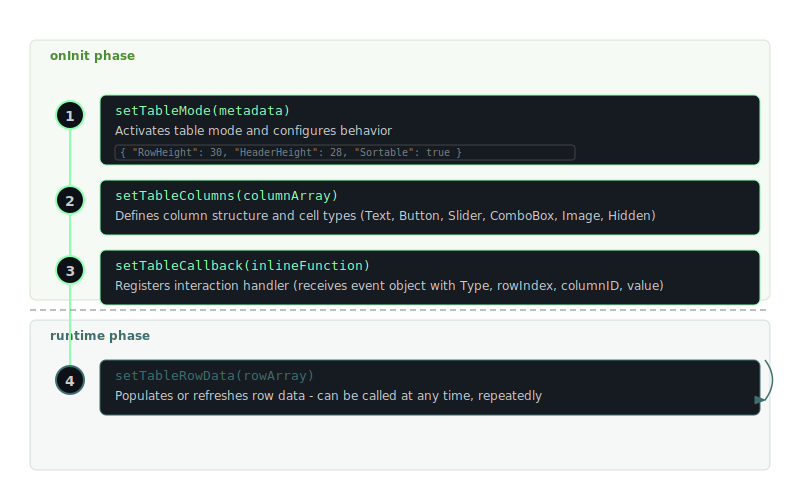

# ScriptedViewport

<!-- Diagram triage:
  - viewport-modes (state): CUT - mode table in prose is clearer than state diagram
  - table-setup (sequence): RENDER - mandatory init sequence not obvious from API alone
-->

ScriptedViewport is a UI component created with `Content.addViewport(name, x, y)` that operates in one of three modes:

| Mode | How to activate | Value |
|------|----------------|-------|
| Viewport | Default (no flags) | Scroll position |
| List | Set `useList` property to `true` | Selected index |
| Table | Call `setTableMode()` in onInit | `[column, row]` array |

Use Viewport mode when you just need a scrollable container. Use List mode for simple item selection. Use Table mode when each row has multiple columns, sorting, or interactive cell types.

In table mode, you define columns, populate rows, and register a callback to handle interactions. The table supports five cell types:

- Text
- Button
- Slider
- ComboBox
- Hidden

Interactive cells fire specialised callbacks with an event object describing the interaction type and value.

> All table setup must happen during `onInit`. Only row data can be updated after init completes. The remaining methods are common to all UI components.

## Common Mistakes

- **$COMMON_MISTAKE_TITLE_TO_BE_REPLACED$**
  **Wrong:** `Viewport1.setTableMode({});` called outside onInit
  **Right:** `// In onInit:\nViewport1.setTableMode({});`
  *setTableMode, setTableColumns, and setTableCallback must be called in onInit only.*

- **$COMMON_MISTAKE_TITLE_TO_BE_REPLACED$**
  **Wrong:** `Viewport1.setTableColumns([...]);` without calling setTableMode first
  **Right:** `Viewport1.setTableMode({});\nViewport1.setTableColumns([...]);`
  *setTableColumns requires setTableMode to be called first to create the internal table model.*

- **$COMMON_MISTAKE_TITLE_TO_BE_REPLACED$**
  **Wrong:** Using `obj.rowIndex` directly to index into the data array when sorting is enabled
  **Right:** Using `viewport.getOriginalRowIndex(obj.rowIndex)` to map back to the original data index
  *When the table is sorted, display indices no longer match the original array positions. Mutations (favourites, deletion) applied to the wrong index corrupt data silently.*

- **$COMMON_MISTAKE_TITLE_TO_BE_REPLACED$**
  **Wrong:** Setting `viewPositionY` to a pixel value
  **Right:** Setting `viewPositionY` to a normalised 0.0-1.0 value
  *The scroll position properties are normalised, not pixel-based. Use `(targetRow + 1) / totalRows` to scroll to a specific row.*
