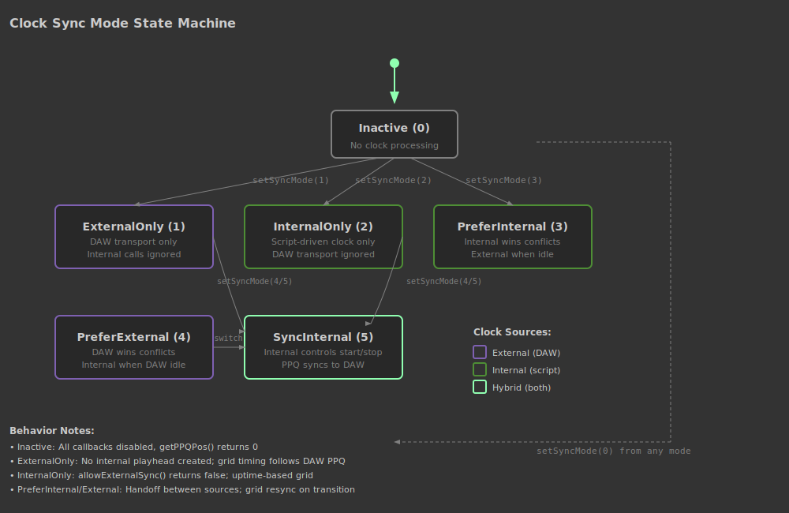

# TransportHandler

TransportHandler registers callbacks that fire when the DAW transport state changes: tempo, playback, beats, time signature, high-precision grid events, and plugin bypass. Each callback (except bypass) supports synchronous (audio-thread) or asynchronous (UI-thread) dispatch, allowing you to react to transport events in real-time audio logic or UI updates. The class also provides an internal clock system with configurable sync modes - you can follow the DAW exclusively, run your own independent clock, or blend the two with fallback behavior.

The grid system provides sample-accurate timing events at a configurable musical rate (whole note down to 64th triplet). Enable the global grid with `setEnableGrid()`, then register a grid callback that receives a sample timestamp offset for sub-block scheduling precision. The grid supports per-instance rate division (`setLocalGridMultiplier()`) and bypass (`setLocalGridBypassed()`), allowing multiple TransportHandler instances to operate at different subdivisions of the same master grid.

Most operations are global - they affect the shared MasterClock. When you call `startInternalClock()`, `stopInternalClock()`, or `setSyncMode()` on any TransportHandler instance, all instances see the change. Callbacks and local grid settings are per-instance.

## Common Mistakes

- **Wrong:** `th.setOnGridChange(SyncNotification, onGrid);` without calling `th.setEnableGrid(true, tempoFactor)`  
  **Right:** Call `th.setEnableGrid(true, 7)` before registering the grid callback  
  *The grid must be enabled globally before grid callbacks fire. Without it, the grid callback is registered but never triggered.*

- **Wrong:** Using a regular `function` with `SyncNotification`  
  **Right:** Use `inline function` for synchronous callbacks  
  *Synchronous callbacks run on the audio thread and require `inline function`. A regular function will throw "Must use inline functions for synchronous callback" at registration.*

- **Wrong:** Calling `startInternalClock(0)` from a MIDI callback  
  **Right:** Call `startInternalClock(Message.getTimestamp())` from MIDI callbacks  
  *The timestamp parameter provides sample-accurate positioning within the audio block. Using 0 always starts at the block boundary, which can cause timing jitter of up to one block size.*

- **Wrong:** Updating UI components directly in the transport callback  
  **Right:** Bridge the transport callback to a Broadcaster  
  *When multiple script files need to react to transport changes, direct component updates create tight coupling. Passing a Broadcaster as the callback function enables loose coupling across many listener sites.*

- **Wrong:** Not stopping the internal clock before loading a preset  
  **Right:** Call `stopInternalClock(0)` before `Engine.loadUserPreset()`  
  *Loading a preset while the clock is running can cause timing discontinuities. Stop playback first, then call `sendGridSyncOnNextCallback()` and restart the clock after the preset loads.*
