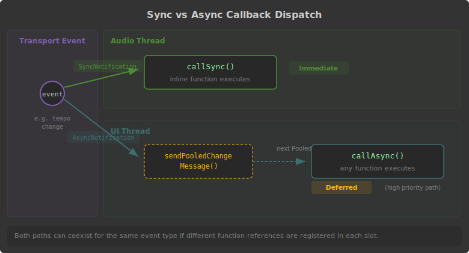

<!-- Diagram triage:
  - sync-async-dispatch: RENDER (threading distinction is critical and hard to convey in prose alone)
  - clock-sync-modes: CUT (6 modes already clear in a table; the state transitions are straightforward)
-->
# TransportHandler

TransportHandler lets you react to DAW transport events -- tempo changes, play/stop, beat positions, time signature changes, and a high-precision grid timer for sample-accurate sequencing. Create one with `Engine.createTransportHandler()` and register callbacks for the events you need. Each callback can be dispatched synchronously on the audio thread (pass `SyncNotification`) or asynchronously on the UI thread (pass `AsyncNotification`). Synchronous callbacks must use `inline function`.

The class also provides an internal clock system for standalone or DAW-independent operation, controlled by `setSyncMode()`. The sync mode determines which clock source -- external (DAW) or internal (script-driven via `startInternalClock`/`stopInternalClock`) -- drives transport callbacks, grid timing, and BPM. For plugins that should follow the DAW when hosted but maintain their own transport standalone, use `PreferExternal`. See `setSyncMode()` for the full list of six modes. When testing sync modes in the HISE IDE, the "external clock" is the IDE's built-in transport bar; in an exported plugin, it is the actual DAW transport.

For sample-accurate sequencing, enable the grid with `setEnableGrid()` and register a grid callback via `setOnGridChange()`. The grid callback receives a sample-accurate timestamp offset that you can use to place events precisely within an audio block. Each TransportHandler instance can run at a different grid subdivision using `setLocalGridMultiplier()`, and can independently bypass its grid via `setLocalGridBypassed()`.

